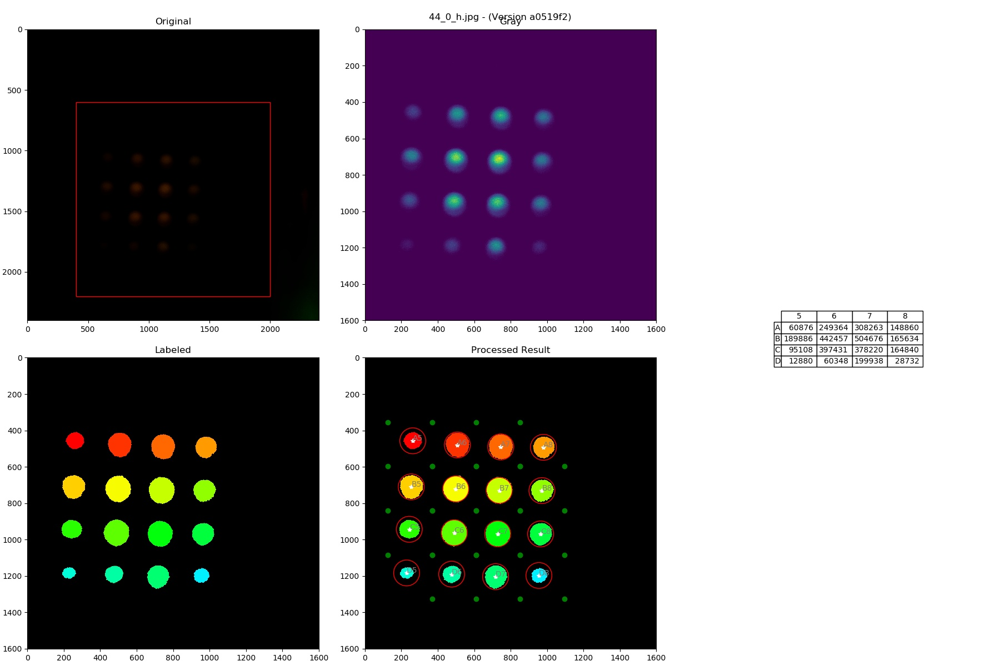

# PIX2RFU

## How to use
### 1. Make Datasheet in CFX96 format from the real-time PCR images.
To create a datasheet from entire images
```
$ activate rfu
$ cd rfu
$ python pix2rfu_32well.py "F:/path to experiment directory"
```
It will create `DSP_datasheet` folder in the experiment path, and save datasheets according to the CFX96 format.

if there are missing dye,
```
$ python pix2rfu_32well.py "F:/path to experiment directory" -d <missing dyes>
# for example, if FAM and HEX channels are missing
$ python pix2rfu_32well.py "F:/path to experiment directory" -d f h
```

The acceptable inputs are the following:

Intended Value | Valid Input
---------------|-------------
FAM | `f`
HEX | `h`
Cal Red 610 | `c`
Quasar 670 | `q6`
Quasar 705 | `q7`

**(UPCOMING)** if there are missing columns or rows
```
$ python pix2rfu_32well.py "F:/path to experiment directory" -c <numbers of missing cols> -r <numbers of missing rows>
```

### 2. Get image processing result from an image

To look into the image processing result
```
$ python pix2rfu_32well.py "F:/path to experiment directory" i <temp> <dye> <cycle> <well>
```
where `temp` is Low or High, `dye` is one of `['f', 'h', 'c', 'q6', 'q7']`, well is well name such as A1 and b3, and cycle is a number between 1 and TC (total cycle).

Intended Value | Valid Input
---------------|-------------
Low Temperature (QuantStep60) | `low`, `Low`
High Temperature (QuantStep72) | `high`, `High`
FAM | `f`
HEX | `h`
Cal Red 610 | `c`
Quasar 670 | `q6`
Quasar 705 | `q7`
Well name | `A1`, `a1`, `a01`, `A01`
Cycle number | Any number from 1 to total cycle. e.g. `2`

This will produce the following image.

It is composed of 4 images, and one data table.
  * Original: the original image from camera with cropping area as a red rectangle
  * Gray: the 2D density plot from cropped image with sum of RGB
  * Labeled: the image of labeled objects after image processing the gray image
  * Processed Result: the result image with objects with well location
  * Data table: table of RFU values, which are sum of RGB, corresponding to their well location

**It will be more helpful to identify causes of issues if you are attaching these images as posting a new issue**

### 3. Get image processing result from an image of single camera test
If you wish to take a look at an image processing result with single image for the test purpose, try the following feature:
```
$ python pix2rfu_32well.py "F:/path to a 16 well image" s
```
This will produce the similar image processing result as the above except the part that it creates the well grid (green dot areas) from the current images instead of the reference image.

## Requirements
### Environment
- Python 3.5.3
- Conda
- git

### Installation with virtual environment (Windows)
```
$ git clone https://github.com/ympaik87/rfu.git
$ conda create -n rfu python=3.5.3
$ activate rfu
$ cd rfu
$ pip install -r requirements.txt
```

### To update the code
```
$ git pull
```

If you have local changes, and it causes to abort `git pull`, one way to get around this is this:

```
# removing the local changes
$ git stash
# update
$ git pull
# put the local changes back on top of the recent update
$ git stash pop
```
